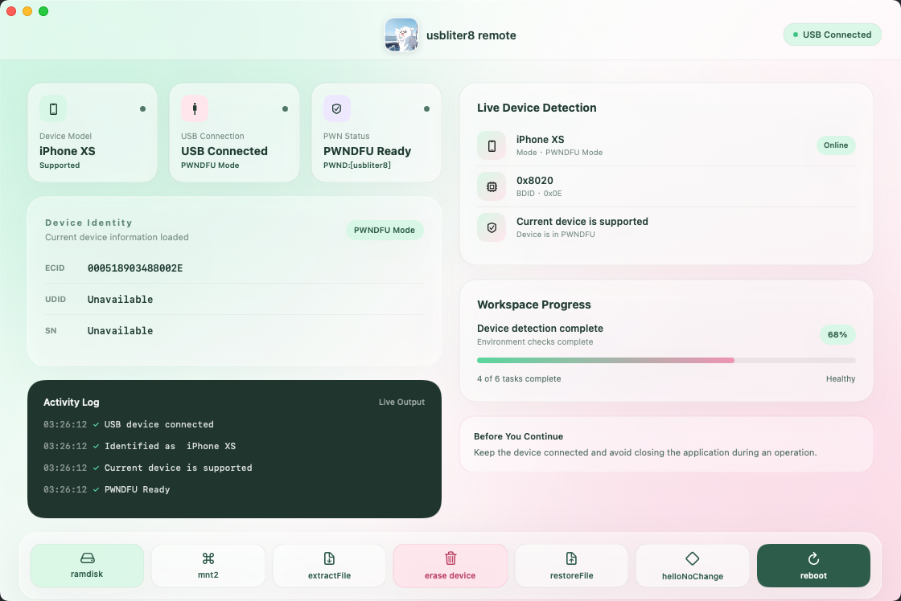

# 🐱 usbliter8 remote

> **License:** This project is source-available under the [PolyForm Noncommercial License 1.0.0](LICENSE.md). Commercial use, resale, paid distribution, commercial service integration, and repackaging for profit require prior written permission from the copyright holder. See [NOTICE.md](NOTICE.md) for copyright and branding terms.



## 1. Build from source

**Build requirements:**
- macOS 12.0 Monterey or later
- Xcode command-line tools

**Build steps:**

```bash
cd "usbliter8 remote"
./Scripts/build_universal_app.sh
```

This produces a Universal binary at `dist/usbliter8 remote.app` that runs natively on both Intel (x86_64) and Apple Silicon (arm64) Macs.

### Build directly with Xcode

Open `usbliter8-remote.xcodeproj` in Xcode, select the `usbliter8Remote` scheme, and press **Run** or **Build**. The generated project is included for users who prefer a graphical Xcode workflow.

The build produces a native `arm64 + x86_64` Universal application. Protected resources remain encrypted in the repository and application bundle.

## 2. Usage flows

### Lock-screen workflow

Use this sequence when the device is at the lock screen:

```text
ramdisk → mnt2 → extractFile → erase device → ramdisk → mnt2 → restoreFile
```

1. Start `ramdisk` with the device's installed iOS version.
2. Run `mnt2` to mount `/mnt2`.
3. Run `extractFile` to create a device-specific backup on the Desktop.
4. Confirm `erase device` when prompted after extraction.
5. Start `ramdisk` again after the device reboots.
6. Run `mnt2` again.
7. Run `restoreFile` and select the matching backup directory.
8. Reboot when the restore operation is complete.

### Hello-screen workflow

Use this sequence when the device is at the Hello screen:

```text
ramdisk → mnt2 → helloNoChange
```

1. Start `ramdisk` with the device's installed iOS version.
2. Run `mnt2`.
3. Run `helloNoChange`.
4. Follow the on-screen completion message and wait for the device to reboot.

### Reboot

The `reboot` action is intended for a device already connected to the Ramdisk SSH environment. Keep the USB connection active until the operation finishes.

## 3. Research-only notice

This project is provided for research, interoperability testing, and educational purposes only. Use it only on devices and resources you own or are authorized to test. The author is not responsible for data loss, device damage, service disruption, or any illegal, unauthorized, or abusive use of this software. Users are solely responsible for complying with applicable laws and third-party terms.

## Encrypted resources

Protected resources are stored as multilayer AES-256-GCM ciphertext. No plaintext PHP, shell, Python, or private resource package is included in the repository or release application. Runtime working files are created in restricted temporary directories and removed after each operation; no persistent decrypted cache is used.

## Release signing

The default build uses an ad-hoc signature with Hardened Runtime enabled. For a production release, provide a Developer ID identity:

```bash
SIGN_IDENTITY="Developer ID Application: Example Corp (TEAMID)" \
  ./Scripts/build_universal_app.sh
```

Production distributions should also be notarized with Apple's `notarytool`.
